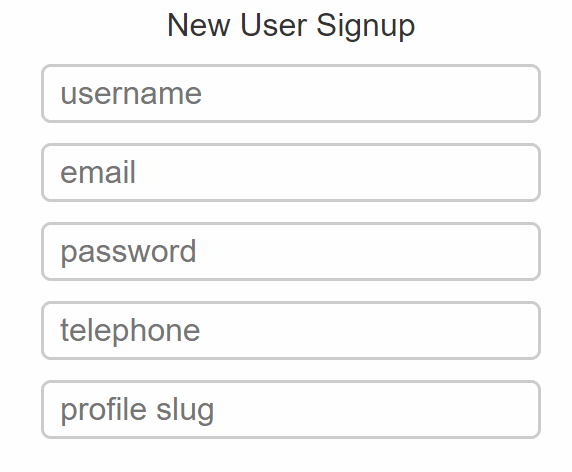

# Playlist Regex
Arquivos do curso para a lista de reprodução [Regular Expressions][1] em JavaScript no canal [The Net Ninja][2].

[Exemplo][3]:

[1]:https://www.youtube.com/watch?v=r6I-Ahc0HB4&list=PL4cUxeGkcC9g6m_6Sld9Q4jzqdqHd2HiD&index=1
[2]:https://www.youtube.com/channel/UCW5YeuERMmlnqo4oq8vwUpg
[3]:https://rcarteri.github.io/regex-playlist/
